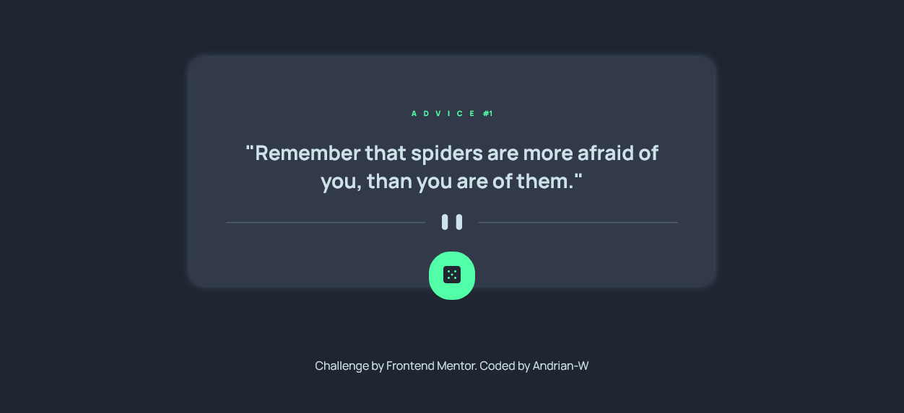

# Frontend Mentor - Advice generator app solution

This is a solution to the [Advice generator app challenge on Frontend Mentor](https://www.frontendmentor.io/challenges/advice-generator-app-QdUG-13db). Frontend Mentor challenges help you improve your coding skills by building realistic projects.

## Table of contents

- [Overview](#overview)
  - [Screenshot](#screenshot)
  - [Links](#links)
- [My process](#my-process)
  - [Built with](#built-with)
- [Author](#author)

## Overview

### Screenshot

### Links

- Live Site URL: [Click Here](https://andrian-w.github.io/advice-generator/)

## My process

### Built with

- Semantic HTML5 markup
- Flexbox
- Scss
- Desktop-first workflow
- [React](https://reactjs.org/) - JS library

## Author

- Website - [Andriano Wijaya]
- Frontend Mentor - [@Andrian-W](https://www.frontendmentor.io/profile/Andrian-W)

**Note: Delete this note and add/remove/edit lines above based on what links you'd like to share.**
